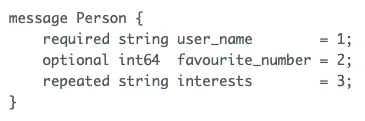

# RPC

- Remote Procedure Callsの略称
- stub: ClientとServerに存在し、データのserialization・deserializationを行うレイヤ
- interfaceを利用して通信する

# gRPC

REST API (JSON)の場合

protocol buffers定義

serialization
- Protocol Bufferを用いてインタフェースを定義する
    - `.proto`ファイルに定義する

# REST APIでは何が足りないのか？

- REST APIではXML、JSONなどリクエストボディがserializationがないため、同じ情報に必要なデータの容量が高い。
- REST APIはHTTP Protocol 1.1を基準にしているが、gRPCは HTTP protocol 2を利用している。
    - **Multiplexing**
      
    - **Header Compression(ヘッダー圧縮)**
      